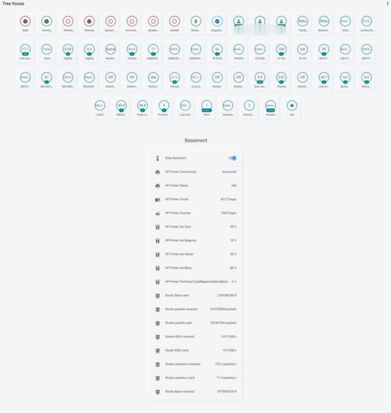

# Lovelace Soft UI light theme
  
Home Assistant light theme, built on from @JuanMTech, using style boilerplates from @thomasloven and @N-L1.  
This theme depends on [`card-mod`](https://github.com/thomasloven/lovelace-card-mod) for the soft-ui styling.  
Looking for the [dark theme instead?](https://github.com/KTibow/lovelace-dark-soft-ui-theme/)  
And [these things are supported](https://github.com/KTibow/lovelace-light-soft-ui-theme/issues/3).  
## Screenshot

## Features
- Can instantly declutter an auto-generated dashboard, without needing to edit it (and disable auto-generation)
- Works with auto-generated dashboards and handmade ones
- Works with badges
- Gives cards in dashboards and cards everywhere soft UI
- Can help to make your config smaller:
  - You can just house each card separately, instead of having to use a vertical stack.
  - You can remove plain styling, and just style what's important.
## Notes
These notes may be outdated, and most of the time you can just use `!important`. You should probably just look at the [source](https://git.io/JJBsz).

Expand anyway

This theme can modify how you style cards. Here's some points:
- To add soft-ui to cameras, there's extra margin and border radius added to the images and label.
- All non-markdown cards will be given background. Make it transparent instead to undo.
- All non-markdown, non-custom-button-card, non-entities, non-custom-mod-card cards will be given 30px margin and a standard box shadow.
- The whole entity card will have no shadow, 30px margin vertically, and 20px margin horizontally.
- Every entity in the entities card will have 8px padding up/down, `display: block`, `95%` width, and margin `0 auto 0 5px`.
- All media control cards will have text color of `5F6267` and background color that matches.
- The actual entities in the entities card will have standard box shadow, border radius, and `12px` margin and `10px` padding.
- The header of the entities card will have no box shadow, and the name will use `100%` of the card width and be centered.
- The badge area will take up `90%` width max, centered horizontally, and with 8px vertical margin.
- All cards will be constrained vertically, with just 1 column and max width of `500px`. (Technically there's multiple columns, but we stack them vertically. Also panel mode won't be affected.)
- The badge will have `5px` border radius, `11px 8px` padding, `11px 12px` margin, `inline-block` display, and a standard thin box shadow.
- Badge color will be changed (I don't fully understand how it works)
- Descriptions will be clamped to one line, and font size will be `1em`.
- More info dialogs will cause the background to be blurred by `2.5px`, and make it slightly whited out. The dialog will have standard border radius, and a background of `rgba(255, 255, 255, 0.8)`, and the header will have the same background as the rest.

## Your own colors?
Sure! Just add the card-mod styling part to the end of your theme.
