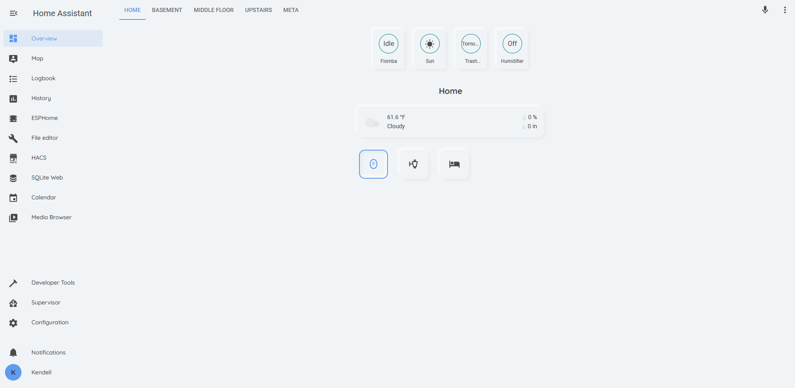

# Lovelace Soft UI light theme
  
Home Assistant light theme, built on from @JuanMTech, using style boilerplates from @thomasloven and @N-L1.
This theme depends on [`card-mod`](https://github.com/thomasloven/lovelace-card-mod) for the soft-ui styling.
Looking for the [dark theme instead?](https://github.com/KTibow/lovelace-dark-soft-ui-theme/)
## Screenshot

## Features
- Works with auto-generated dashboards and handmade ones
- Works with badges
- Gives cards in dashboards and cards everywhere soft UI
